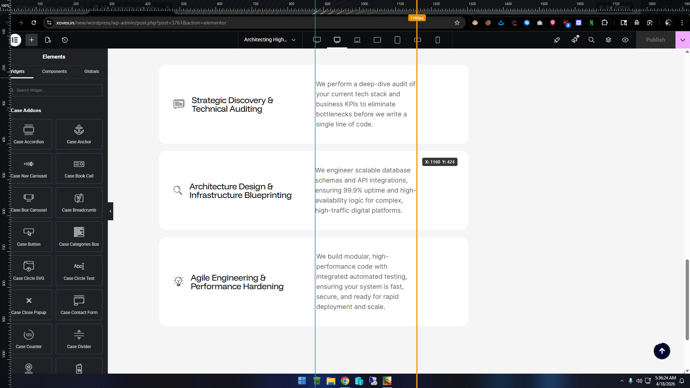
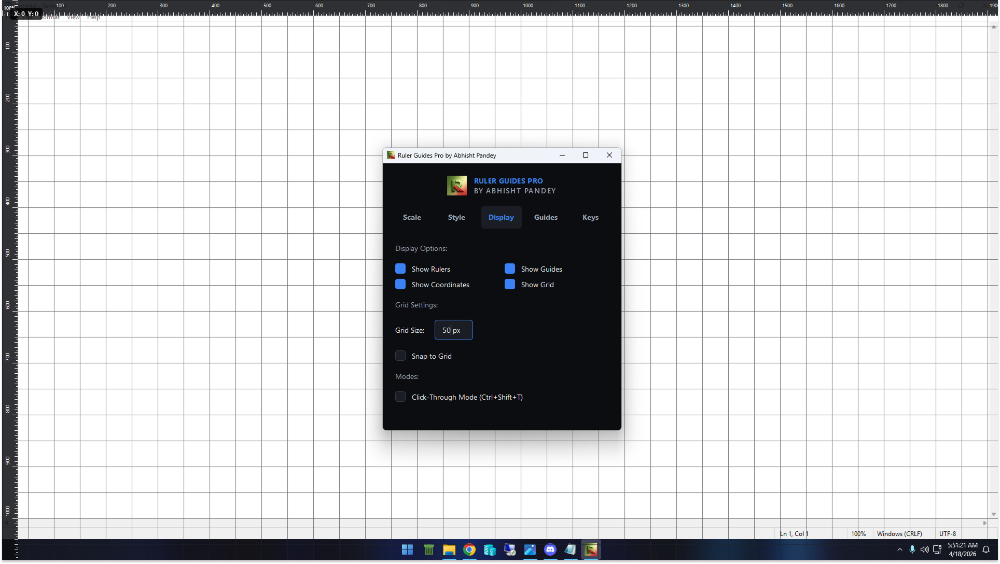

# 📐 Ruler Guides Pro

**Ruler Guides Pro** is a pixel-perfect, premium screen overlay tool built for UI/UX designers, frontend developers, and QA engineers. It brings Photoshop-style precision measuring guides natively to your entire Windows desktop.

---

## 📸 Screenshots
*(Developer Note: Upload your screenshots to your repository, name them `ruler_screenshot1.png`, etc., and place them in the `assets/` folder)*

*Beautiful, distraction-free modern dark-mode control panel.*

*Pixel-perfect overlay working on top of Visual Studio Code & Web Browsers.*

---

## ✨ Features (What makes it special?)

- **🛡️ True Click-Through Mode:** Create your guides, lock them, and turn on click-through mode. The guides will stay floating on your screen while you freely click, code, and design on the visual layers *beneath* them.
- **⚡ System-Wide Global Hotkeys:** Control the rulers, hide/show guides, or lock the layout instantly from any desktop application without ever breaking your workflow.
- **🎨 Premium Minimalist UI:** Built with an obsession for detail — featuring a completely flat, borderless dark-mode aesthetic, refined typography, and gorgeous visual indicators.
- **💾 Persistent Layouts:** Working on a specific 12-column website grid? Save your custom guide setups and load them instantly on your next session.
- **🚀 Advanced Native Compilation:** Entirely bundled with Nuitka into a single, high-performance `.exe` binary. No Python installation required for the end-user.

---

## ⌨️ Global Shortcuts

| Shortcut | Action |
| :--- | :--- |
| **`Ctrl` + `Shift` + `R`** | Toggle Rulers Visibility |
| **`Ctrl` + `Shift` + `G`** | Toggle Guides Visibility |
| **`Ctrl` + `Shift` + `T`** | Toggle Click-Through Mode |
| **`Ctrl` + `Shift` + `C`** | Clear all active guides |
| **`Ctrl` + `Shift` + `P`** | Show/Hide Control Panel |

> *Full mouse controls and nudge-shortcuts are explicitly listed in the "Keys" section of the application's Control Panel.*

---

## 🛠️ How to Use & Install

We have organized the codebase to be incredibly user-friendly and fully automated using `.bat` scripts.

### Option 1: Using Source Code (For Developers)
1. Ensure you have **Python 3.11+** installed on your system.
2. Double-click `install_requirements.bat` (This safely sets up all required libraries).
3. Double-click `02_Run_Application.bat` to launch the application.

### Option 2: Build Your Own `.exe` (For Distribution)
1. Double-click `03_Build_Executable.bat`.
2. The script will automatically trigger **Nuitka**, auto-download necessary C++ compilers natively, and silently build a standalone `.exe`. It automatically embeds proper Windows metadata (Native Icon, Copyright, Version info). 
3. Share the generated `Ruler Guides Pro.exe` with anyone — they won't need Python installed to run your application!

---

## 🧑‍💻 Author & Branding

**Created & Designed by Abhisht Pandey**  
Copyright (C) 2026. All rights reserved. 

If you find this tool helpful in your creative/development workflow, feel free to star the repo and contribute!
